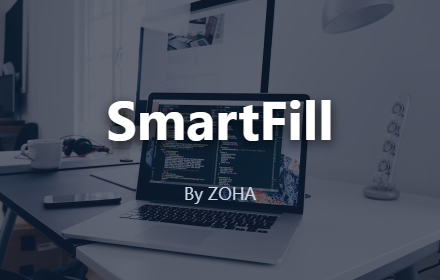
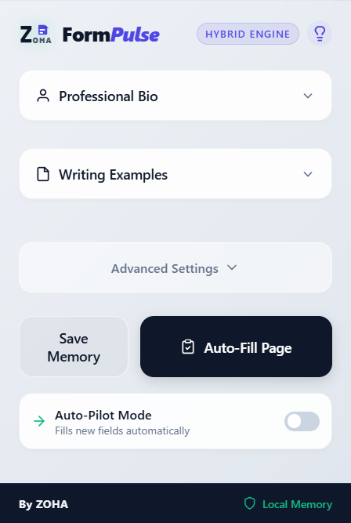

# SmartFill - AI Form Filler

SmartFill is a powerful Chrome extension that instantly fills repetitive forms, job applications, and portals using a smart three-layer engine.

## Features

1. **Local Profile:** For instant, offline filling of basic info (Name, Email, DOB).
2. **Memory Vault:** Securely store and reuse your custom answers.
3. **AI Engine:** Dynamically answer complex, open-ended questions and write cover letters using your exact tone and professional bio.

### The UI

*The main extension popup interface.*

## Installation

1. Download the latest `SmartFill v1.0.0.zip` release from the Releases tab.
2. Open Chrome and navigate to `chrome://extensions`.
3. Enable **Developer mode** in the top right corner.
4. Drag and drop the `.zip` file onto the page, or extract it and click **Load unpacked**.

## Usage & Documentation

Upon installation, SmartFill will automatically open the **User Manual**. This built-in manual contains everything you need to know about setting up your API keys, configuring your profile, and using the Memory Vault. 

You can also view the manual source code directly in this repository: [User Manual (manual.html)](./manual.html)

You can access the manual at any time by right-clicking the extension icon and selecting **Options**.

---
*Built with care by ZOHA.*
